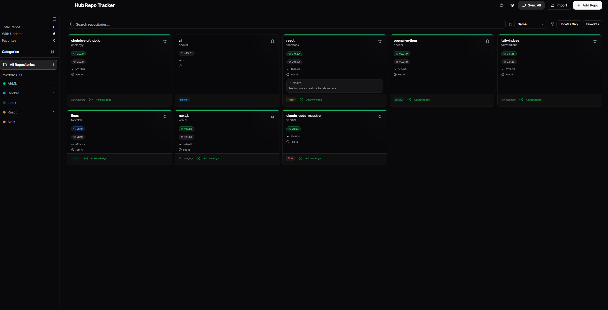

# Hub Repo Tracker

[](https://opensource.org/licenses/MIT)
[](https://nodejs.org/)
[](https://www.docker.com/)

**Hub Repo Tracker** is a professional, self-hosted dashboard designed to centralize and monitor your GitHub repositories. It goes beyond simple bookmarking by tracking releases, commits, and allowing you to maintain personal technical notes for every project.

> **Why Hub Repo Tracker?** Because "Starring" a repo on GitHub is easy, but remembering *why* you starred it or knowing when it has a critical new release is hard.

---


*A professional dashboard to centralize and track your GitHub ecosystem.*

---

## 🚀 Key Features

### 🧠 Second Brain for Developers

- **Personal Notes:** Keep track of implementation details, ideas, or reminders for each repository.
- **Custom Categories:** Organize repos into logic groups (e.g., "AI/ML", "DevOps", "Frontend UI").
- **Owner-based Auto-grouping:** Automatically group repositories by their GitHub owner/organization.

### 🔔 Smart Version Tracking

- **Acknowledged Release System:** Unlike other trackers, notifications stay visible until you manually "acknowledge" them. Never miss a critical update again.
- **3-Tier Detection:** Tracks official **Releases**, **Git Tags**, and **Last Commits** to give you a complete picture of project activity.
- **Version Comparison:** Easily see the difference between your "installed version" and the latest available upstream.

### 📁 Advanced Import & Local Sync

- **Unlimited Server-Side Scanning:** Bypasses browser restrictions to scan any folder on your system (e.g., `C:\Users\muham`, `/home/user`) directly from the backend.
- **Smart Recursive Scanning:** Automatically detects nested repositories up to 4 levels deep, intelligently ignoring heavy folders like `node_modules` or `dist`.
- **Local Browser Fallback:** Includes a browser-native scanner for quick, single-folder imports without server access.
- **Local Path Association:** Link a remote repository to its local directory on your machine.

---

## ⚡ Quick Start (No Setup Required)

The fastest way to get started is using `npx`. No cloning, `.env` files, or manual installation required.

```bash
npx hub-repo-tracker
```

1. **Launch**: Run the command above.
2. **Configure**: Click the **Gear (Settings)** icon in the dashboard.
3. **Connect**: Paste your [GitHub Token](https://github.com/settings/tokens) in the **General** tab and click **Save**.

That's it! Your token is stored securely in your local database.

### Global Installation

If you want the command available permanently without `npx`:

```bash
npm install -g hub-repo-tracker
hub-repo-tracker
```

---

## 🛠️ Alternative Installation

### 🐳 The Docker Way (Recommended for Servers)

The most stable way to run Hub Repo Tracker on a server is via Docker Compose.

```bash
# 1. Clone the repository
git clone https://github.com/muhammet/hub-repo-tracker.git
cd hub-repo-tracker

# 2. Setup environment
cp .env.example .env
# Edit .env and add your GITHUB_TOKEN

# 3. Spin up the containers
docker-compose up -d --build
```

Access the dashboard at `http://localhost:3750`.

### 💻 Local Development

Quickly get started with a single command for both frontend and backend.

```bash
# Install all dependencies (Root, Backend, Frontend)
npm run install:all

# Start both servers concurrently
npm run dev
```

---

## 🗑️ Uninstallation & Data Management

Hub Repo Tracker keeps your data separate from the application logic to ensure you don't lose your notes during updates.

### Global Uninstall

If you installed the package globally:

```bash
npm uninstall -g hub-repo-tracker
```

### Cleaning Data

The application stores its database and settings in a `data/` folder within the directory where it was launched. To completely remove all traces:

1. Uninstall the package (as shown above).
2. Manually delete the `data/` folder in your workspace.

---

## 🏗️ Technical Stack

- **Backend:** Node.js, Fastify, TypeScript, SQLite (better-sqlite3)
- **Frontend:** React 18, Vite, TailwindCSS, shadcn/ui, Radix UI
- **API:** Octokit (GitHub REST SDK)
- **Containerization:** Docker, Nginx

---

## 🤝 Contributing

Contributions are welcome! Whether it's a bug report, a new feature idea, or a translation, feel free to open an Issue or a Pull Request.

1. Fork the Project
2. Create your Feature Branch (`git checkout -b feature/AmazingFeature`)
3. Commit your Changes (`git commit -m 'Add some AmazingFeature'`)
4. Push to the Branch (`git push origin feature/AmazingFeature`)
5. Open a Pull Request

---

## 📄 License

Distributed under the MIT License. See `LICENSE` for more information.

---

*Built with ❤️ for the open-source community.*
